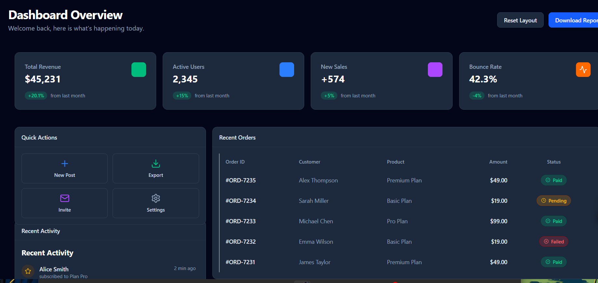

# React SaaS Dashboard Demo



A modern, responsive, and interactive Admin Dashboard template built with **React**, **Vite**, **Tailwind CSS v4**, and **React Grid Layout**.

This project demonstrates how to build a flexible, drag-and-drop grid interface similar to generic SaaS platforms, complete with realistic data visualization and widgets.

## ✨ Features

- **📱 Fully Responsive**: Adapts perfectly to desktops, tablets, and mobile screens.
- **🧩 Drag & Drop Grid**: Customize your workspace by dragging and resizing widgets using `react-grid-layout`.
- **💾 Persistent Layout**: Your customized layout is automatically saved to `localStorage`.
- **📊 Rich Data Visualization**:
  - **Interactive Area Charts** for revenue trends (powered by `recharts`).
  - **Donut Charts** for traffic source analysis.
- **⚡ Modern UI Components**:
  - Beautiful status badges and indicators.
  - Glassmorphism-inspired design elements.
  - Dark mode compatible styling (system preference).
- **🚀 High Performance**: Built on Vite for lightning-fast HMR and production builds.

## 🛠️ Tech Stack

- **Framework**: React 19 + TypeScript
- **Build Tool**: Vite
- **Styling**: Tailwind CSS v4
- **Layout Engine**: React Grid Layout
- **Icons**: Lucide React
- **Charts**: Recharts
- **Utilities**: Lodash

## 🚀 Getting Started

### Prerequisites

Make sure you have Node.js installed (LTS version recommended).

### Installation

1.  **Clone the repository**
    ```bash
    git clone https://github.com/yourusername/project-react-grid.git
    cd project-react-grid
    ```

2.  **Install dependencies**
    ```bash
    npm install
    # or
    yarn install
    ```

3.  **Start the development server**
    ```bash
    npm run dev
    ```

4.  **Build for production**
    ```bash
    npm run build
    ```

## 📂 Project Structure

```
src/
├── components/
│   ├── Dashboard.tsx        # Main grid container and layout logic
│   ├── Widget.tsx           # Wrapper component for grid items
│   ├── StatCard.tsx         # Metric display card
│   ├── RevenueChart.tsx     # Area chart widget
│   ├── TrafficSourceChart.tsx # Pie chart widget
│   ├── RecentOrdersTable.tsx # Data table widget
│   ├── ActivityFeed.tsx     # List widget
│   ├── ServerStatus.tsx     # System status widget
│   └── QuickActions.tsx     # Action buttons widget
├── App.tsx                  # Root app component
├── index.css                # Global styles & Tailwind import
└── main.tsx                 # Entry point
```

## 🎨 Layout Configuration

The dashboard uses a 12-column grid system. You can easily modify the default layout in `src/components/Dashboard.tsx`:

```typescript
const initialLayouts = {
  lg: [
    { i: 'stat1', x: 0, y: 0, w: 3, h: 4, type: 'stat-revenue' },
    // ... define your widgets here
  ],
};
```

## 📝 License

This project is open-source and available under the [MIT License](LICENSE).

---

> Built with ❤️ using [React Grid Layout](https://github.com/react-grid-layout/react-grid-layout)
